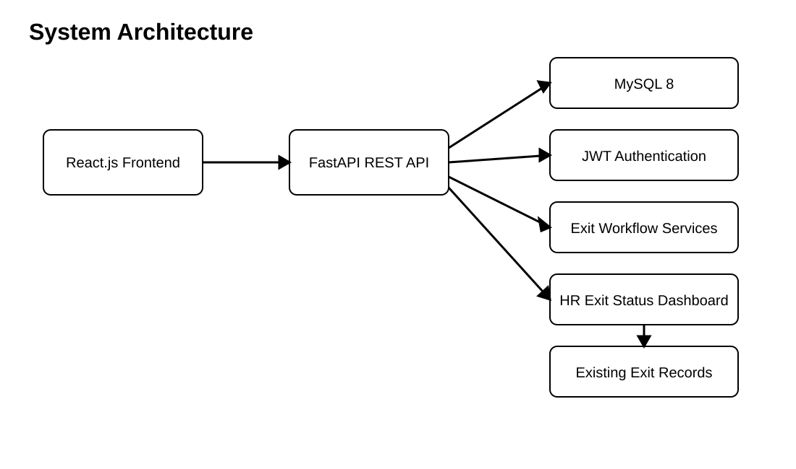

# Employee Exit Management System

Employee Exit Management System is a full-stack application for submitting, reviewing, approving, and tracking employee exit requests.

## Live Demo
- Frontend: https://employee-exit-management-system.vercel.app
- Backend: https://employee-exit-management-system-ez72.onrender.com
- API Documentation: https://employee-exit-management-system-ez72.onrender.com/docs

## Overview
The system gives employees a structured way to submit exit requests and view their progress. HR users can review requests, manage approvals, record exit interviews, track clearance activities, and view consolidated exit progress. The application uses a React frontend, FastAPI backend, and MySQL database.

## Architecture Diagram


Design artifacts:
- [System Architecture](docs/diagrams/system-architecture.md)
- [ER Diagram](docs/diagrams/er-diagram.md)
- [Class Diagram](docs/diagrams/class-diagram.md)
- [Module Diagram](docs/diagrams/module-diagram.md)

## Tech Stack
| Layer | Technology |
| --- | --- |
| Frontend | React.js, JavaScript, Bootstrap, Axios |
| Backend | Python, FastAPI |
| Authentication | JWT, bcrypt, OTP verification |
| Data Access | SQLAlchemy |
| Database | MySQL 8 |
| Testing | Pytest |
| API Documentation | FastAPI Swagger |

## Features
### Employee
- Register with OTP verification and strong password validation
- Sign in
- Submit an exit request
- View own exit requests and statuses

### HR
- Review employee exit requests
- Approve or reject requests
- Manage exit interviews
- Manage clearance tasks
- Review audit records
- View exit status and progress dashboard

## Screenshots
Screenshots of the key application screens can be added from the deployed application.

## Getting Started
### Prerequisites
- Python 3.10 or later
- Node.js 18 or later
- MySQL 8

### Clone and install
```text
git clone https://github.com/Gopiga-2006/employee-exit-management-system.git
cd employee-exit-management-system
```

### Backend
```text
python -m venv venv
pip install -r requirements.txt
uvicorn app.main:app --reload
```

### Frontend
```text
cd frontend
npm install
npm run dev
```

### Environment Variables
Copy `.env.example` to `.env` and provide the local database and application settings.

## Environment Variables
| Name | Description | Required |
| --- | --- | --- |
| DATABASE_URL | MySQL connection string | Yes |
| JWT_SECRET | Secret used to sign login tokens | Yes |
| JWT_EXPIRE_MINUTES | Token lifetime in minutes | Yes |
| SMTP_HOST | SMTP server for OTP delivery | Production |
| SMTP_PORT | SMTP server port | Production |
| SMTP_USERNAME | SMTP account username | Production |
| SMTP_PASSWORD | SMTP account password or app password | Production |
| SMTP_FROM | Sender address for OTP email | Production |
| OTP_DELIVERY | OTP delivery mode (`console` for local testing, `smtp` for email) | No |

## API Documentation
The deployed FastAPI Swagger documentation is available at:
https://employee-exit-management-system-ez72.onrender.com/docs

When the backend is running locally, Swagger is available at `/docs`.

## Running Tests
```text
pytest
```

## Deployment
The application is deployed with the React frontend hosted on Vercel, the FastAPI backend hosted on Render, and MySQL hosted on Aiven. GitHub Actions runs the backend quality checks and triggers the backend deployment after successful checks on the main branch.

## Folder Structure
```text
app/
  api/
  core/
  models/
  schemas/
  services/
tests/
docs/
frontend/
```

## Future Enhancements
- Email notifications for important exit-process events
- Employee exit reports and summaries
- Additional HR workflow integrations

## License
MIT

## Author / Contact
Project owner: Gopiga-2006
