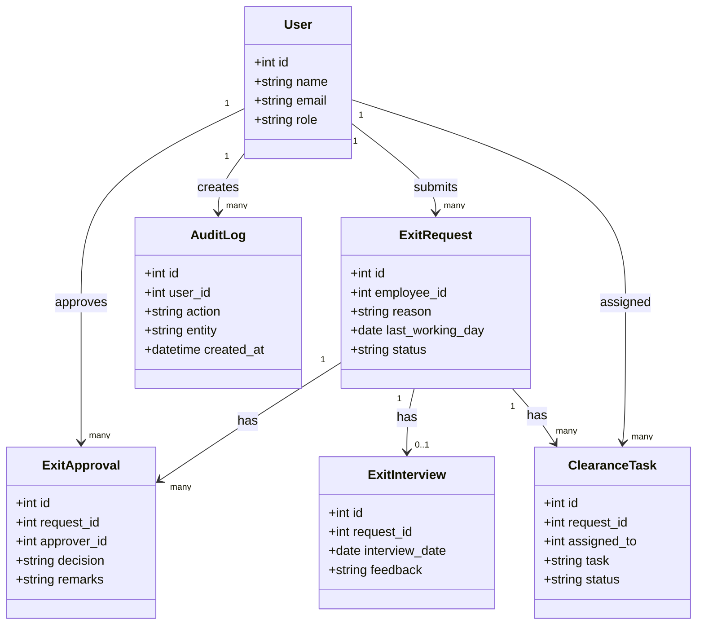

# Class Diagram

```mermaid
classDiagram
    class User {
        +int id
        +string name
        +string email
        +string role
    }
    class ExitRequest {
        +int id
        +int employee_id
        +string reason
        +date last_working_day
        +string status
    }
    class ExitApproval {
        +int id
        +int request_id
        +int approver_id
        +string decision
        +string remarks
    }
    class ExitInterview {
        +int id
        +int request_id
        +date interview_date
        +string feedback
    }
    class ClearanceTask {
        +int id
        +int request_id
        +int assigned_to
        +string task
        +string status
    }
    class AuditLog {
        +int id
        +int user_id
        +string action
        +string entity
        +datetime created_at
    }
    User "1" --> "many" ExitRequest : submits
    User "1" --> "many" ExitApproval : approves
    ExitRequest "1" --> "many" ExitApproval : has
    ExitRequest "1" --> "0..1" ExitInterview : has
    ExitRequest "1" --> "many" ClearanceTask : has
    User "1" --> "many" ClearanceTask : assigned
    User "1" --> "many" AuditLog : creates
```
