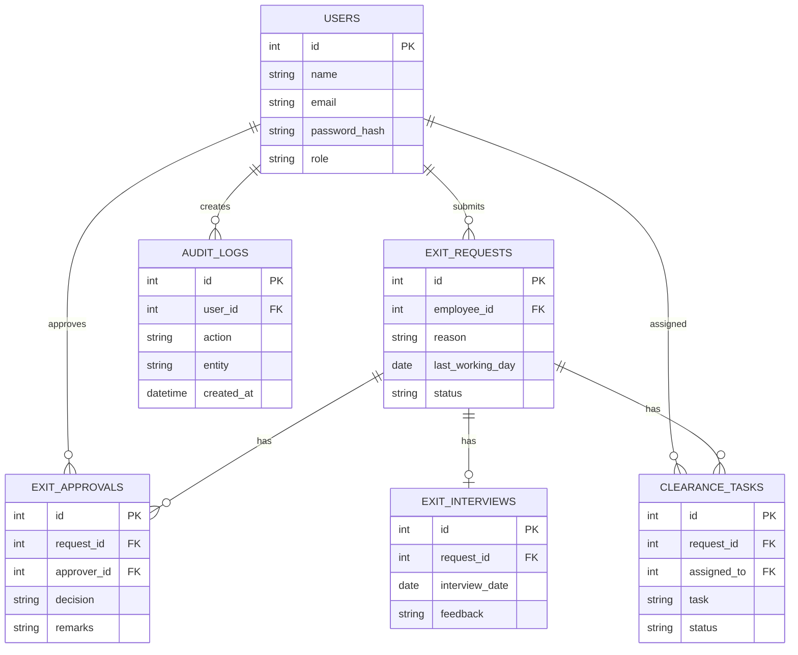

# Entity Relationship Diagram

```mermaid
erDiagram
    USERS ||--o{ EXIT_REQUESTS : submits
    USERS ||--o{ EXIT_APPROVALS : approves
    EXIT_REQUESTS ||--o{ EXIT_APPROVALS : has
    EXIT_REQUESTS ||--o| EXIT_INTERVIEWS : has
    USERS ||--o{ CLEARANCE_TASKS : assigned
    EXIT_REQUESTS ||--o{ CLEARANCE_TASKS : has
    USERS ||--o{ AUDIT_LOGS : creates

    USERS {
        int id PK
        string name
        string email
        string password_hash
        string role
    }
    EXIT_REQUESTS {
        int id PK
        int employee_id FK
        string reason
        date last_working_day
        string status
    }
    EXIT_APPROVALS {
        int id PK
        int request_id FK
        int approver_id FK
        string decision
        string remarks
    }
    EXIT_INTERVIEWS {
        int id PK
        int request_id FK
        date interview_date
        string feedback
    }
    CLEARANCE_TASKS {
        int id PK
        int request_id FK
        int assigned_to FK
        string task
        string status
    }
    AUDIT_LOGS {
        int id PK
        int user_id FK
        string action
        string entity
        datetime created_at
    }
```
