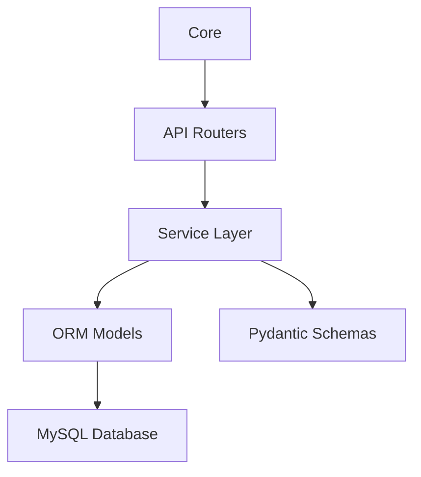

# Module Diagram

## Main Modules
- `app/api/`: REST API routers.
- `app/core/`: settings, security helpers, and database setup.
- `app/models/`: SQLAlchemy models.
- `app/schemas/`: request and response schemas.
- `app/services/`: business logic.
- `tests/`: automated tests added in later development work.
