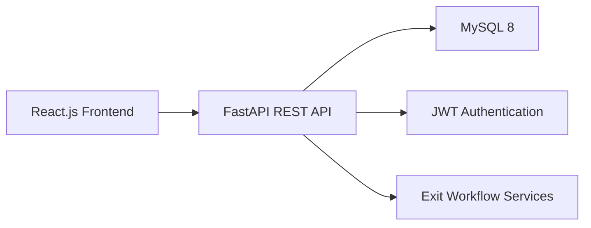

# System Architecture

## Layers
- Client layer: React.js, Bootstrap, Axios.
- Backend/API layer: FastAPI REST endpoints under `/api/`.
- Application layer: authentication and exit workflow services.
- Database layer: MySQL 8 accessed through SQLAlchemy.
- Deployment: frontend on Vercel, backend on Render, and MySQL database on Aiven.
